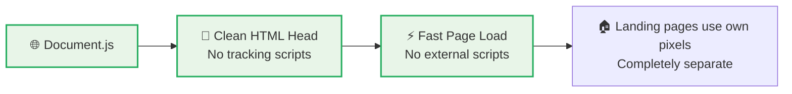
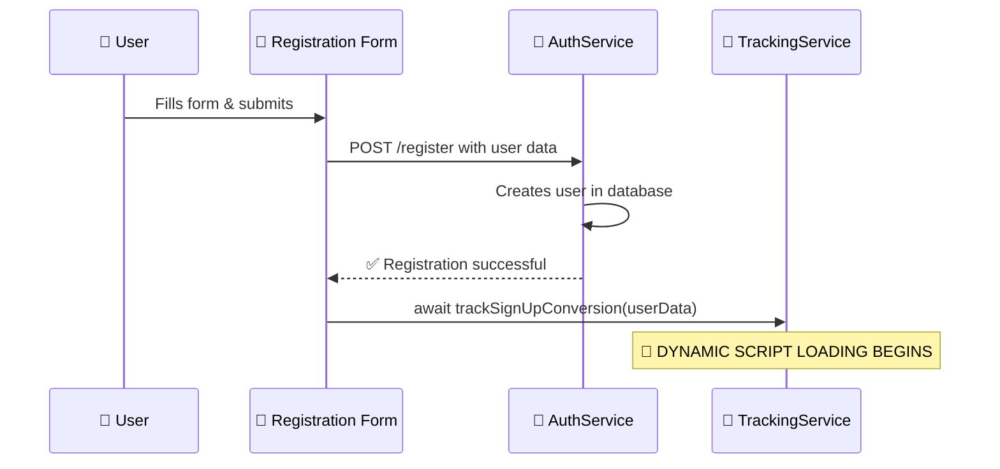
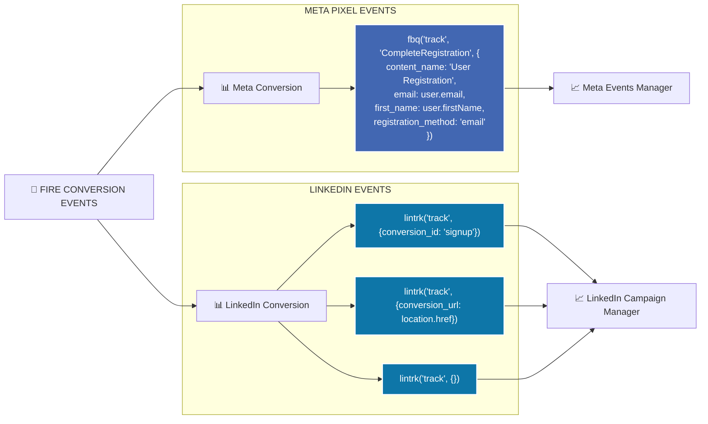
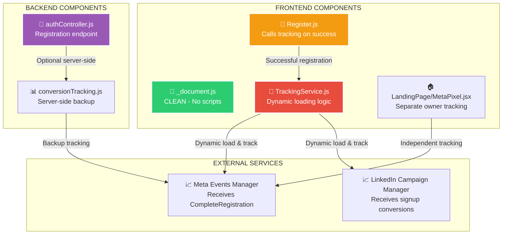
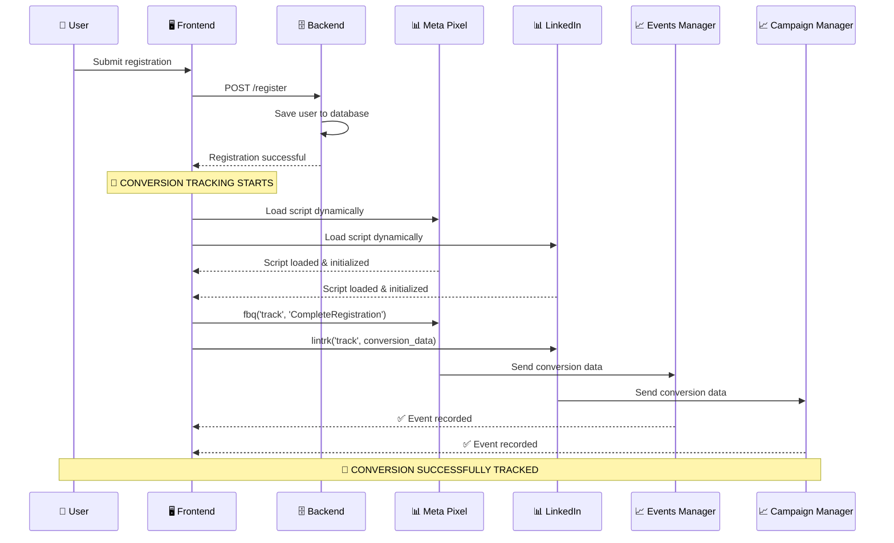
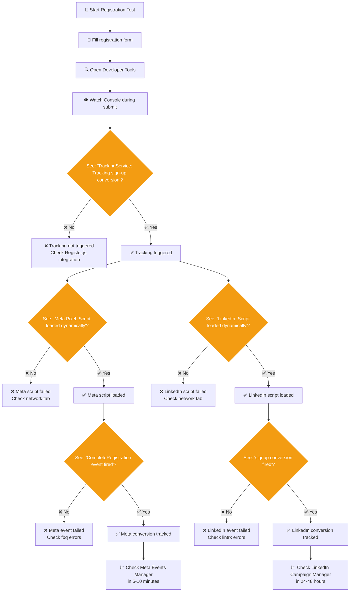

# 🎯 HIRELAB CONVERSION TRACKING FLOW

## COMPLETE SYSTEM OVERVIEW

```mermaid
graph TD
    A[👤 User Visits Hirelab] --> B{Landing Page?}
    B -->|Yes| C[🏠 Landing Page Tracking<br/>Uses owner's pixel ID<br/>Tracks Hirelab.PageView]
    B -->|No| D[📄 Regular Pages<br/>No tracking scripts loaded]
    
    D --> E[📝 User Goes to Registration]
    C --> E
    
    E --> F[🖊️ User Fills Registration Form]
    F --> G[✅ Registration Successful?]
    
    G -->|❌ Failed| H[❌ No Tracking<br/>User stays on form]
    G -->|✅ Success| I[🎯 TRIGGER CONVERSION TRACKING]
    
    I --> J[📞 TrackingService.trackSignUpConversion()]
    
    subgraph "DYNAMIC SCRIPT LOADING"
        J --> K[🔄 Load Meta Pixel Script]
        J --> L[🔄 Load LinkedIn Script]
        
        K --> M[📊 Meta Pixel Loaded?]
        M -->|✅ Yes| N[📡 Fire CompleteRegistration Event]
        M -->|❌ No| O[⚠️ Skip Meta Tracking]
        
        L --> P[📊 LinkedIn Script Loaded?]
        P -->|✅ Yes| Q[📡 Fire LinkedIn Conversion Events]
        P -->|❌ No| R[⚠️ Skip LinkedIn Tracking]
    end
    
    N --> S[📈 Data Sent to Meta Events Manager]
    Q --> T[📈 Data Sent to LinkedIn Campaign Manager]
    O --> U[✅ Registration Complete - Continue Flow]
    R --> U
    S --> U
    T --> U
    
    U --> V[🔄 User Redirects to Dashboard/OTP]
    
    style I fill:#ff6b6b,stroke:#fff,stroke-width:3px,color:#fff
    style J fill:#4ecdc4,stroke:#fff,stroke-width:2px,color:#fff
    style N fill:#45b7d1,stroke:#fff,stroke-width:2px,color:#fff
    style Q fill:#96ceb4,stroke:#fff,stroke-width:2px,color:#fff
```

## DETAILED STEP-BY-STEP BREAKDOWN

### 🏁 PHASE 1: INITIAL STATE (ZERO IMPACT)



### 📝 PHASE 2: REGISTRATION TRIGGER



### 🔄 PHASE 3: DYNAMIC SCRIPT LOADING

```mermaid
graph TD
    A[🎯 trackSignUpConversion()] --> B[📊 Check if Meta loaded]
    A --> C[📊 Check if LinkedIn loaded]
    
    B -->|❌ Not loaded| D[🔄 loadMetaPixelScript()]
    B -->|✅ Already loaded| E[📡 Use existing Meta]
    
    C -->|❌ Not loaded| F[🔄 loadLinkedInScript()]
    C -->|✅ Already loaded| G[📡 Use existing LinkedIn]
    
    subgraph "META PIXEL LOADING"
        D --> H[🔧 Create fbq function]
        H --> I[📜 Load fbevents.js]
        I --> J[🎯 fbq('init', '244408738381890')]
        J --> K[✅ Meta Ready]
    end
    
    subgraph "LINKEDIN LOADING"
        F --> L[🔧 Set _linkedin_partner_id]
        L --> M[📜 Load insight.min.js]
        M --> N[🎯 lintrk ready]
        N --> O[✅ LinkedIn Ready]
    end
    
    E --> P[📡 FIRE CONVERSION EVENTS]
    K --> P
    G --> P
    O --> P
    
    style D fill:#3498db,stroke:#fff,stroke-width:2px,color:#fff
    style F fill:#9b59b6,stroke:#fff,stroke-width:2px,color:#fff
    style P fill:#e74c3c,stroke:#fff,stroke-width:3px,color:#fff
```

### 📡 PHASE 4: CONVERSION EVENT FIRING



## 🏗️ SYSTEM ARCHITECTURE



## 📊 DATA FLOW



## 🔍 DEBUGGING CHECKPOINTS



## 🎯 KEY FEATURES

### ✅ PERFORMANCE OPTIMIZED
- **Zero global scripts** - No impact on page load
- **Dynamic loading** - Scripts only when needed
- **Async operations** - Non-blocking execution

### ✅ NON-INTRUSIVE
- **Landing page tracking intact** - Uses separate pixel IDs
- **Clean document head** - No global pollution
- **Graceful fallbacks** - Continues if tracking fails

### ✅ COMPREHENSIVE TRACKING
- **Meta Pixel** - CompleteRegistration with user data
- **LinkedIn** - Multiple conversion formats for reliability
- **Server-side backup** - Available but optional

### ✅ DEBUG FRIENDLY
- **Console logging** - Track every step
- **Error handling** - Detailed error messages
- **Multiple fallbacks** - LinkedIn uses 3 tracking methods

